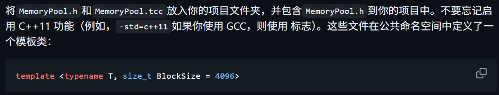
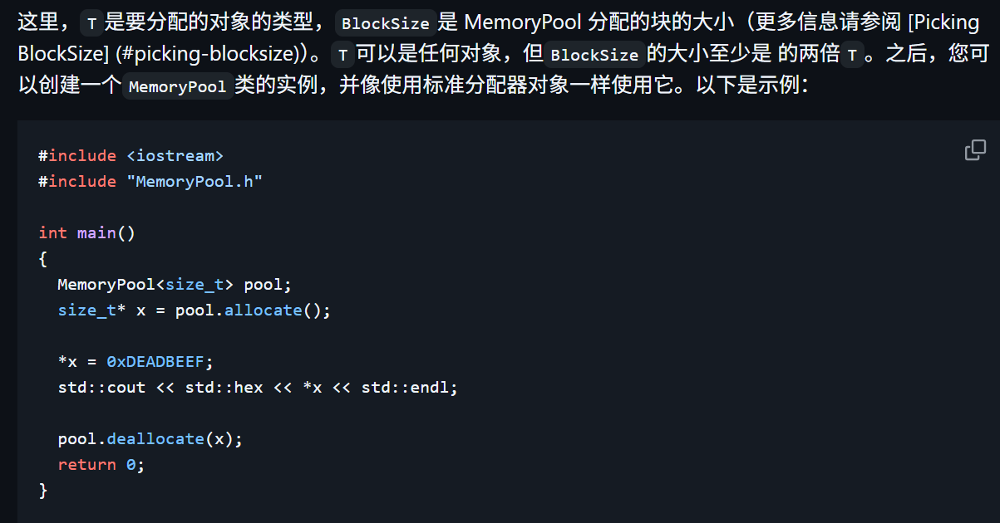
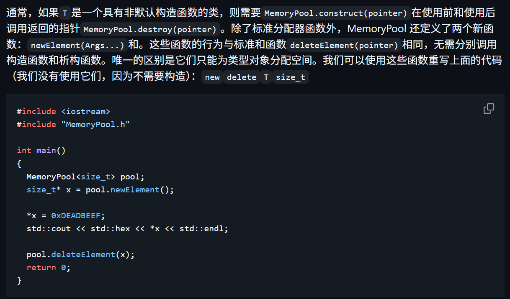
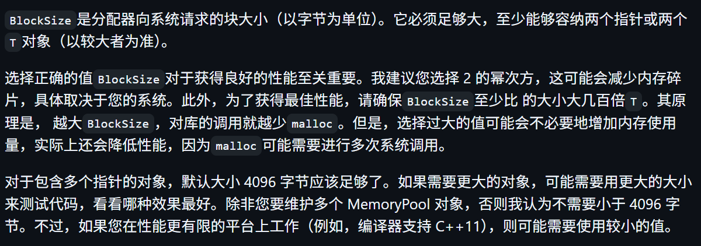
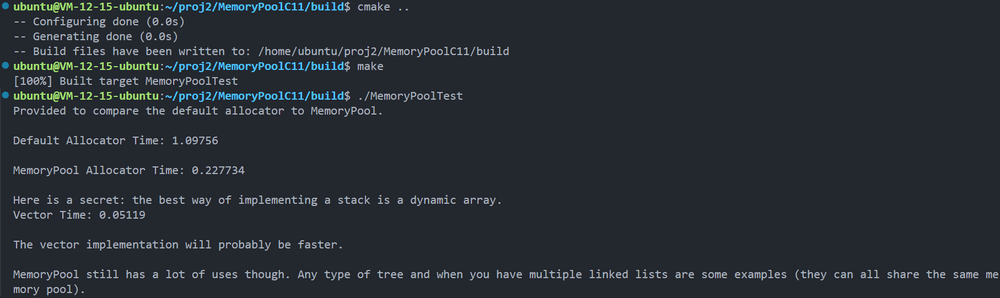
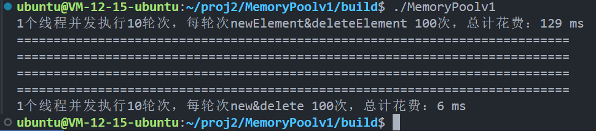

# 什么是内存池


# 何时使用
当你需要分配多个大小相同的对象时，应该使用内存池。这通常发生在实现常见数据结构（例如链表、二叉搜索树、带有链接的哈希表等）时。在这些情况下，使用内存池可以提高性能数倍，并显著减少内存浪费。

# 用法






# 选择区块大小


在项目目录下创建build目录，并进入该目录
```
mkdir build && cd build
```
执行 cmake 命令
```
cmake ..
```
执行 make 命令
```
make
```
删除编译生成的可执行文件：
```
make clean
```
运行
```
./MemoryPoolTest
```

# MemoryPoolC11 实验结果


# MemoryPoolv1 实验结果


上传到github指令
```
echo "# MemoryPool" >> README.md
git init
touch README.md
git add .
git commit -m "first commit"
git branch -M main
git remote add origin git@github.com:LingoRihood/MemoryPool.git
git push -u origin main
```

另附生成ssh key的官方文档链接
https://docs.github.com/en/authentication/connecting-to-github-with-ssh/generating-a-new-ssh-key-and-adding-it-to-the-ssh-agent?platform=linux

如果添加修改文件或二次上传，需要
- git add .
- git commit -m "Added new image"
- git push origin main

本仓库是参考了https://github.com/cacay/MemoryPool及相关仓库写的，里面注释很多，便于初学者理解！